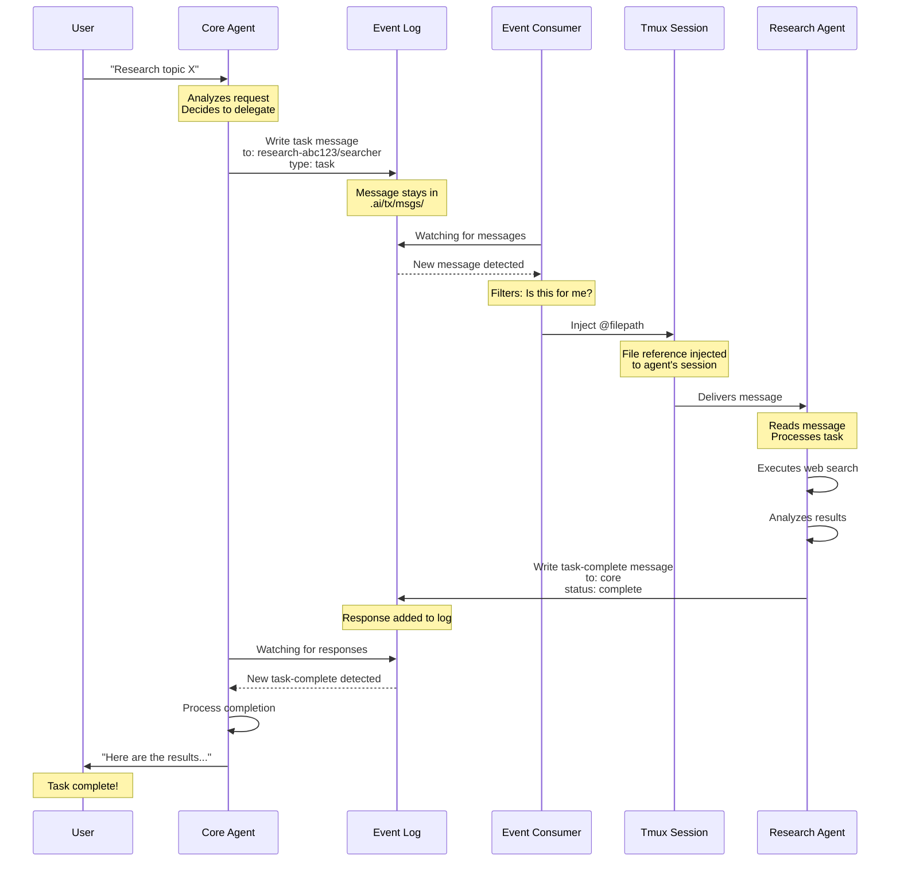

# TX
Thinking, eXponentially
> a single pane of glass to conduct an agentic orchestra

## Objective
Create and execute distributed, observable, composable agentic AI workflows using plain language, tooling and workspaces, via a conversational interface. 

Provide a laboratory for novel uses of LLM with the aim of providing a surface area for Augmented Thinking. 

`tx` is a prototypical middle ground between leveraging the power of specialization within the ease of a generalist workflow. 

## Out Of Scope
- Automation - Augmentation not Automation
- Web Interface - terminal only
- Monetization - too experimental to pay for

## Fundamental Ideas
> specialized agents with domain context outperform generalists
> deterministic behavior needs logical guiderails to be consistent
> quality beats productivity as human review is the bottleneck

> [!IMPORTANT]
> Our mind carries the common thread of thought, and we *wield* AI to extend this thread with the superpowers of PACE: Parallelizable, Adaptable, Comprehensive, Extensible

## Overview
`tx` is a CLI tool which orchestrates `claude-code` instances to provide a message based fundamental backing for agentic AI workflows. Leveraging the existing tooling available brings several advantages:
- Utilize subscriptions vs API keys with LangGraph, CrewAI, etc. 
- No need to reinvent the base agent
- Easy to incorporate into existing setup / extend with claude code tooling
- Can generalize across AI vendors ( future )

Disadvantage:
- harder to automate, automation is against TOS anyway
- likely less performant then highly tuned systems
- doesn't replace cli agents for quick fixes

`tx` is a prototypical middle ground between generalists and specialists, leveraging the power of specialization within the ease of a generalist workflow. 

## Use Cases
- Read an Agentic Research Paper, implement the pattern ( MAP planner = planner )
- Reproducible Multi-step Work Processes ( code-review, tdd, research, gtm-strategy, etc. ) with project knowledge support and queues
- Generate plans informed by prior work, which outperform stock Plan Mode
- Human In The Loop multi-agent interactions

## Prerequisites

**Required:**
- `claude-code` - with Anthropic Subscription / API Keys
- `tmux` - manages all the sessions and message injections
- `node` - JavaScript

### Optional Dependencies

- `searxng` for local search provider
- uses a custom search configuration, `config/searxng/settings.yml` 
- in Docker, this lives in `/etc/searxng/` 
- See `.env.example` for more search API key options that are supported, but honestly they haven't been tire-kicked. Enter and copy to `.env` to use. 

> [!WARNING]
> **Security Notice**: `tx` runs with `claude --dangerously-skip-permissions`. You will need to run that command in advance to accept responsibility for the actions of the agents. You are **strongly advised** to use a containerized, external or other mechanism for isolating the agents from your base system. Consider [safe-claude](https://github.com/eighteyes/safe-claude).
>
> [!NOTE]
> For API Key users, I have hit a peak velocity of 3 million tokens per minute using this system, averaged over 30 seconds. It may not be inexpensive.

## Quick Start

```bash
npm install -g tx-ai
cd <project-folder>
tx start
# wait for initialization
> start a research mesh about successful patterns for distributed agentic AI systems
```

### With safe-claude
```
safe-claude
# once inside docker
claude
# login, accept risks
```

### No Safe-claude
```
claude --dangerously-skip-permissions
# login and accept risks
```

### Once Inside
You will see some commands run, these load the `core` agent prompt. When ready type:
```
spawn a research mesh and send it a task to look up the impact of sonar on whale migration. save the final paper and sources to research/whales/
```

1) `core` will spawn a `research` mesh which will ask questions, search the internet, and deliver your paper.
2) after a minute, you should get the first wave of questions delivered

## Key Concepts

- **`mesh`** - a list of agents, with flexible input / output targets to provide an agentic AI workflow
- **`agent`** - a LLM session within a mesh, with prompts, tools and messaging instructions
- **`capability`** - a prompt to provide a behavior, optionally enhanced / enforced by tools ( like Claude Skills )
- **`workspace`** - a shared space for AIs to collaborate

## Essential Meshes and Agents

- **`core`** - the central coordinator mesh/agent, this is the primary interaction interface for users
- **`brain`** - dedicated to understanding your codebase, consult with this first when planning features
- **`research`** - lightweight internet searcher to source information
- **`deep-research`** - internet search and iterating hypothesizer / disprover for more complicated queries
- **`job-applicator`** - queue some JDs / URLs, it'll churn out some resumes / coverletters. needs your information in `meshes/agents/career/job-applicator/refs/{resume,history}`

### Job Applicator Mesh Example
[](https://asciinema.org/a/754529)

## Features
See `docs/features`

## Event Log Architecture

TX uses a centralized event log for all agent-to-agent messages:

- **Single source of truth**: All messages written to `.ai/tx/msgs/`
- **Chronological ordering**: Timestamped filenames (`MMDDHHMMSS-type-from>to-msgid.md`)
- **Immutable**: Append-only log, never delete or modify

## Workflow

Step-by-step sequence diagram showing a typical workflow from user request to task completion.




### Message Format

Messages are markdown files with YAML frontmatter:

```markdown
---
to: research-807055/interviewer
from: core/core
type: task
msg-id: abc123
timestamp: 2025-11-03T14:30:00.000Z
headline: Analyze user research findings
status: start
---

Please analyze the user research findings and provide...
```

Filename: `1103143000-task-core>interviewer-abc123.md`


## Project Structure

### Runtime information
```
.ai/tx/msgs - centralized event log (all agent messages)
.ai/tx/session - captured session output
.ai/tx/mesh - runtime mesh information
.ai/tx/logs - system messages / errors
```

### Code & Configuration
```
lib - codebase
meshes - AI Instructions / Configurations
meshes/agents - Agent configurations
meshes/mesh-configs - Mesh configurations ( some options apply to all agents )
meshes/prompts/capabilities - Capability instructions
meshes/prompts/templates- system templates for prompts
```

## CLI Reference

### User Commands
```bash
tx start          # Entry point, drops you into a core session
tx attach         # View what a mesh is doing
tx status         # High level overview of what's active
tx stop           # End every session (with automatic session capture)
tx dashboard      # Live dashboard showing all active agents
tx reset <mesh> <agent> # Send /clear + prompt to agent
```

### Event Log & Monitoring
```bash
tx msg                    # View recent messages from event log
tx msg --follow           # Live tail of messages
tx msg --type task        # Filter by message type
tx msg --agent core       # Filter by agent

tx session <mesh> <agent> # View captured session output
tx session list           # List all captured sessions

tx stats                  # System statistics
tx stats --mesh research  # Stats for specific mesh

tx health                 # System health check
tx health --watch         # Live health monitoring
```

### Developer Commands
```bash
tx logs            # See the internals (system logs)
tx prompt          # See an agent prompt
tx clear           # Clear all TX data
```

## Related Projects
[safe-claude](https://github.com/eighteyes/safe-claude) - isolated docker container with shared volume mount for safer agentic coding
[know-cli](https://github.com/eighteyes/know-cli) - opinionated project / code knowledge graph for `brain` to use

## FAQ

### Why not just use Claude Code Skills / Agents / Commands?

Use them! They are powerful. `tx` differs in that it is:
- **Explicitly invoked** - You control when and how agents interact
- **Observable** - Full event log and monitoring of agent communications
- **Composable** - Mix and match agents for different workflows
- **Context isolated** - Dedicated specialists rather than one agent with many tools

Certain patterns, like swarms of Haiku Agents running Explore are better off using native tooling. Haiku doesn't like being told it's not Claude. :D

### Why TX?

**The Problem:**
- Too much manual work nudging `claude-code` agents through multi-step processes
- Implicit tooling where agents select from lists reduces steering adherence
- More tools = cluttered context and reduced effectiveness

**The Solution:**
`tx` aims to provide **LEVERAGE** and an efficient **SURFACE AREA**:
- Tight context with explicit tooling via specialists
- Generalist interface managing specialist agents
- No need to juggle sessions to run code review AND deep research simultaneously

**Rapid Prototyping of Research:**
Academic papers describe successful agentic topologies, but their codebases are nightmares to reproduce. TX makes it fast to replicate these approaches as meshes and trial new patterns. 

### How to test this beast?
```
npm run test:e2e
```