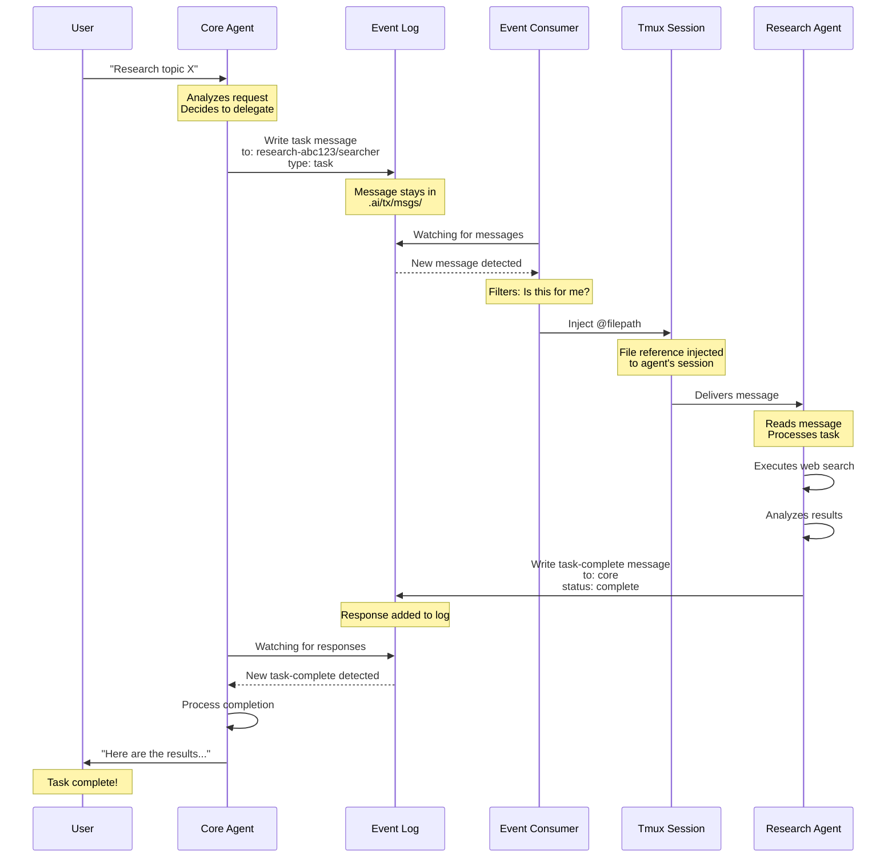

# TX
Thinking, eXponentially
> a single pane of glass to conduct an agentic orchestra

## Objectives
Create and execute distributed, observable, composable agentic AI workflows using plain language, tooling and workspaces, via a conversational interface. 

Provide a laboratory for novel uses of LLM with the aim of providing a surface area for Augmented Thinking. 

`tx` is a prototypical middle ground between leveraging the power of specialization within the ease of a generalist workflow. 

## Out Of Scope
- Automation - Augmentation not Automation
- Web Interface - terminal only
- Monetization - too experimental to pay for

## Fundamental Ideas
> Specialized agents with domain context outperform generalists
> Deterministic behavior needs logical guiderails to be consistent
> Quality beats productivity as human review is the bottleneck

> [!IMPORTANT]
> Our mind carries the common thread of thought, and we *wield* AI with its superpowers of PACE: Parallelizable, Adaptable, Comprehensive, Extensible

## Overview
`tx` is a CLI tool which orchestrates `claude-code` instances to provide a message based fundamental backing for agentic AI workflows. Leveraging the existing tooling available brings several advantages:
- Utilize subscriptions vs API keys only with LangGraph, CrewAI, etc. 
- No need to reinvent the base agent
- Easy to incorporate into existing setup / extend with Claude Code tooling
- Can generalize across AI vendors ( future )

Disadvantages:
- Harder to automate
- Less performant than highly tuned systems
- Doesn't replace CLI agents for quick fixes

`tx` is a prototypical middle ground between generalists and specialists, leveraging the power of specialization within the ease of a generalist workflow. 

## Use Cases
- Read an agentic research paper, implement the pattern
- Reproducible multi-step work processes with project knowledge support and queues
- Generate plans informed by prior work that consistently outperform stock plans
- Human-in-the-loop multi-agent interactions

## Prerequisites

**Required:**
- `claude-code` - with Anthropic Subscription / API Keys
- `tmux` - manages all the sessions and message injections
- `npm/node` - JavaScript

### Optional Dependencies

- `SearXNG` for local search provider
- Uses a custom search configuration, `config/searxng/settings.yml`
- In Docker, this lives in `/etc/searxng/` 
- See `.env.example` for more search API key options that are supported, but they haven't all been tire-kicked. Enter and copy to `.env` to use. 

> [!WARNING]
> **Security Notice**: `tx` runs with `claude --dangerously-skip-permissions`. You will need to run that command in advance to accept responsibility for the actions of the agents. You are **strongly advised** to use a containerized, external or other mechanism for isolating the agents from your base system. Consider [safe-claude](https://github.com/eighteyes/safe-claude).

> [!NOTE]
> For API Key users, I have hit a peak velocity of 3 million tokens per minute using this system, averaged over 30 seconds. It may not be inexpensive.

## Quick Start

```bash
npm install -g tx-ai
cd <project-folder>
claude --dangerously-skip-permissions # Run, login/accept danger and exit
# Or use safe-claude
tx start
# Wait for initialization, here are example language patterns:
> Start a research mesh, give it a task to research successful patterns for distributed agentic AI systems
> Spawn a brain mesh, ask it to report back what it knows about this project
> I want to add a feature flag system to this project, for features x,y,z, consult with brain and make a plan, save to .ai/plans/feature-flag.md and hand it off to the tdd-cycle agent for implementation
```

## Key Concepts

- **`mesh`** - A list of agents, with flexible input / output targets to provide an agentic AI workflow
- **`agent`** - A LLM session within a mesh, with prompts, tools and messaging instructions
- **`capability`** - A prompt to provide a behavior, optionally enhanced / enforced by tools (like Claude Skills)
- **`workspace`** - A shared space for AIs in a mesh to collaborate

## Essential Meshes and Agents
These are `persistent` in that they are designed to not operate in parallel, and keep saved workspace files past restart.
- **`core`** - The central coordinator mesh/agent, this is the primary interaction interface for users
- **`brain`** - Dedicated to understanding your codebase, consult with this first when planning features

These are `ephemeral`, each instance is isolated and workspace information does not persist.
- **`research`** - Lightweight internet searcher to source information
- **`deep-research`** - Internet search and iterating hypothesizer / disprover for more complicated queries
- **`planner`** - Implementation of [Modular Agentic Planner](https://www.nature.com/articles/s41467-025-63804-5)
- **`gtm-strategy`** - Researches approaches in your vertical and breaks your product launch into bite-sized actions
- **`tdd-cycle`** - (beta) Red-green-refactor agent cycles for development
- **`product-arch`** - (alpha) Product-informed software development architecture
- **`job-applicator`** - Queue some JDs / URLs, it'll churn out some resumes / cover letters. Needs your information set in `meshes/agents/career/job-applicator/refs/{resume,history}`

### Job Applicator Mesh Example
Each job application is processed in a clean context. No details will 'spill' between jobs.
[](https://asciinema.org/a/754529)

# System Details
## Event Log Architecture

TX uses a centralized event log for all agent-to-agent messages:

- **Single source of truth**: All messages written to `.ai/tx/msgs/`
- **Chronological ordering**: Timestamped filenames (`MMDDHHMMSS-type-from>to-msgid.md`)
- **Immutable**: Append-only log, never delete or modify

## Workflow

Step-by-step sequence diagram showing a typical workflow from user request to task completion.




### Message Format

Messages are markdown files with YAML frontmatter:

```markdown
---
to: research-807055/interviewer
from: core/core
type: task
msg-id: abc123
timestamp: 2025-11-03T14:30:00.000Z
headline: Analyze user research findings
status: start
---

Please analyze the user research findings and provide...
```

Filename: `1103143000-task-core>interviewer-abc123.md`


## Project Structure

### Runtime information
```
.ai/tx/msgs - centralized event log (all agent messages)
.ai/tx/session - captured session output
.ai/tx/mesh - runtime mesh information
.ai/tx/logs - system messages / errors
```

### Code & Configuration
```
lib - codebase
meshes - AI Instructions / Configurations
meshes/agents - Agent configurations
meshes/mesh-configs - Mesh configurations ( some options apply to all agents )
meshes/prompts/capabilities - Capability instructions
meshes/prompts/templates - system templates for prompts
```

## CLI Reference

### User Commands
```bash
tx start          # Entry point, drops you into a core session
tx attach         # View what a mesh is doing
tx status         # High level overview of what's active
tx stop           # End every session (with automatic session capture)
tx dashboard      # Live dashboard showing all active agents
tx reset <mesh> <agent> # Send /clear + prompt to agent
```

### Event Log & Monitoring
```bash
tx msg                    # View recent messages from event log
tx msg --follow           # Live tail of messages
tx msg --type task        # Filter by message type
tx msg --agent core       # Filter by agent

tx session <mesh> <agent> # View captured session output
tx session list           # List all captured sessions

tx stats                  # System statistics
tx stats --mesh research  # Stats for specific mesh

tx health                 # System health check
tx health --watch         # Live health monitoring
```

### Agent Tools
Agent-invocable utilities for common operations. These commands are designed to be called by mesh agents but can also be used directly.

#### Git Worktree Management
```bash
# Create a new worktree for a feature branch
tx tool worktree add "feat/new-feature"

# Create worktree from specific base branch
tx tool worktree add "feat/new" --base=develop

# List all worktrees
tx tool worktree list

# Remove a worktree
tx tool worktree remove "feat/old"

# Clean up stale worktrees
tx tool worktree prune

# Log operations to event log (for agent use)
tx tool worktree add "feat/thing" --log --from=core --to=user
```

#### Git Merge Operations
```bash
# Start a merge
tx tool merge start feat/branch-to-merge

# Check merge status
tx tool merge status

# List conflicts
tx tool merge conflicts

# Resolve conflict using strategy (ours, theirs, or ai)
tx tool merge resolve file.js --strategy=ours
tx tool merge resolve file.js --strategy=theirs
tx tool merge resolve file.js --strategy=ai  # Returns AI-friendly analysis

# Abort merge
tx tool merge abort

# Log operations to event log (for agent use)
tx tool merge start feat/thing --log --from=core
```

**AI-Assisted Conflict Resolution:**
When using `--strategy=ai`, the tool returns structured conflict analysis with:
- Context lines before and after each conflict
- Both versions (ours vs theirs) clearly labeled
- File type-specific suggestions
- Formatted prompt for AI processing

Example agent workflow:
```bash
# Agent detects conflicts
tx tool merge start feat/new --log
# {"status": "conflicts", "conflicts": [...]}

# Get AI-ready conflict analysis
tx tool merge resolve conflict.js --strategy=ai
# Returns structured analysis with resolution prompt

# After AI resolves, agent applies the resolution
# (uses ConflictResolver.applyResolution() programmatically)
```

### Developer Commands
```bash
tx logs            # See the internals (system logs)
tx prompt          # See an agent prompt
tx clear           # Clear all TX data
```

# Related Projects
[safe-claude](https://github.com/eighteyes/safe-claude) - isolated docker container with shared volume mount for safer agentic coding
[know-cli](https://github.com/eighteyes/know-cli) - opinionated project / code knowledge graph for `brain` to use

# FAQ

### Why not just use Claude Code Skills / Agents / Commands?

Use them! They are powerful. `tx` differs in that it is:
- **Explicitly invoked** - You control when and how agents interact
- **Observable** - Full event log and monitoring of agent communications
- **Composable** - Mix and match agents for different workflows
- **Context isolated** - Dedicated specialists rather than one agent with many tools

Certain patterns, like swarms of Haiku Agents running Explore are better off using native tooling. Haiku doesn't like being told it's not Claude. :D

### Why TX?

**The Problem:**
- Too much manual work nudging `claude-code` agents through multi-step processes
- Implicit tooling where agents select from lists reduces steering adherence
- More tools, skills, MCP, agents = cluttered context and reduced effectiveness

**The Solution:**
`tx` aims to provide **LEVERAGE** and an efficient **SURFACE AREA**:
- Tight context with explicit tooling via specialists
- Generalist interface managing specialist agents
- No need to juggle sessions to run code review AND deep research simultaneously

**Rapid Prototyping of Research:**
Academic papers describe successful agentic topologies, but their codebases are nightmares to reproduce. TX makes it fast to replicate these approaches as meshes and trial new patterns. 

### How to test this beast?
```bash
npm run test:e2e
```
