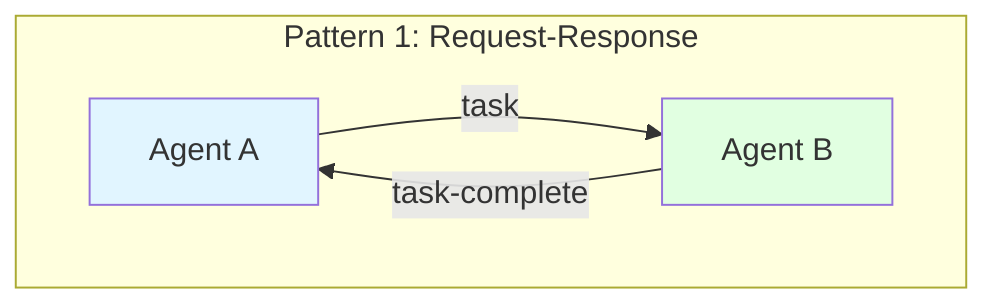
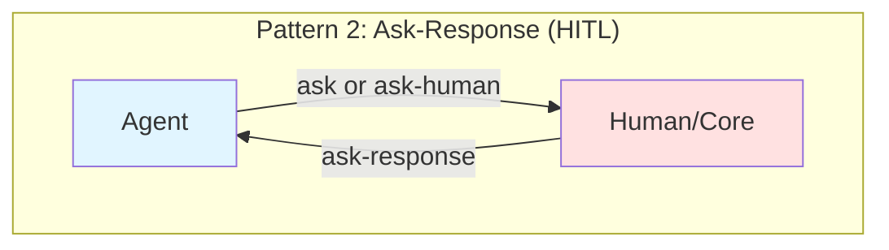
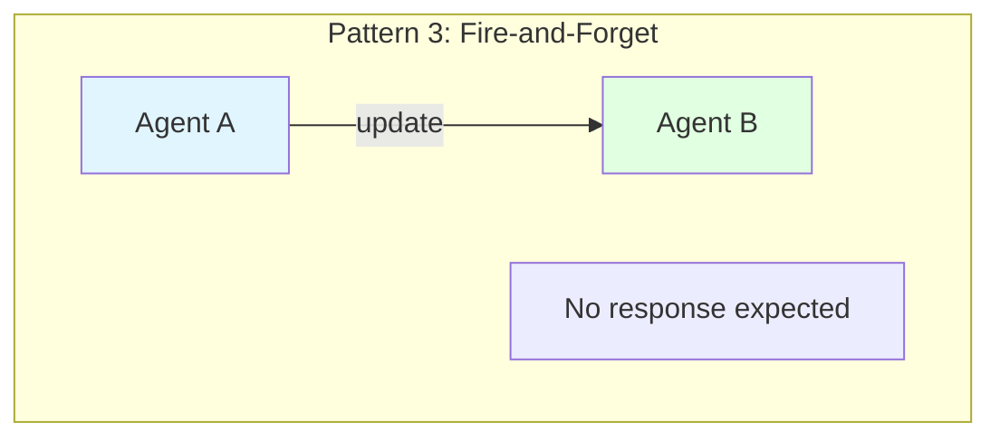
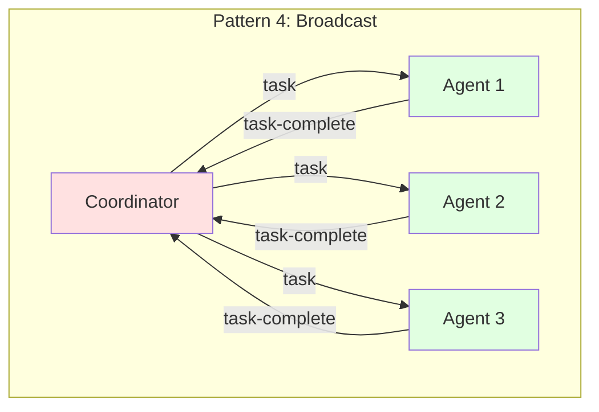
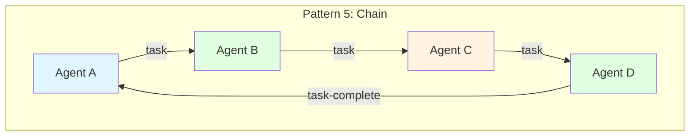
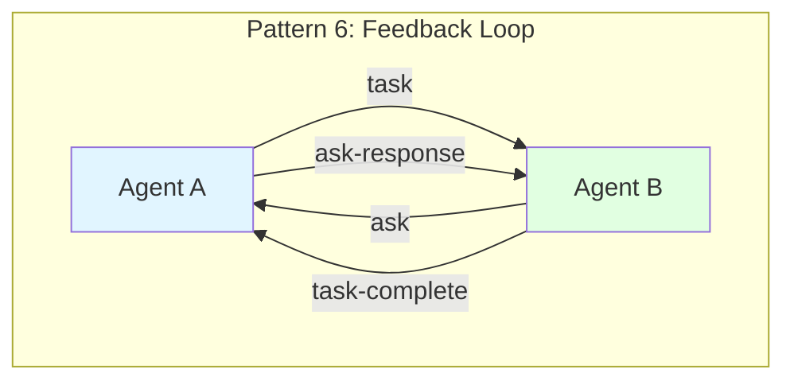

# Agent Communication Patterns

Common communication patterns between agents using the event log messaging system.

## Pattern Descriptions

### Pattern 1: Request-Response (Task Delegation)



**Most common pattern** - One agent delegates work to another.

**Flow**:
1. Agent A sends `task` message to Agent B
2. Agent B processes task
3. Agent B sends `task-complete` message to Agent A

**Example**:
```
Core → Research Agent: "Research topic X"
Research Agent → Core: "Here are the findings..."
```

**Use Case**: Delegating specialized work

---

### Pattern 2: Ask-Response (Question & Answer)



**Interactive pattern** - Agent needs information or decision.

**Flow**:
1. Agent sends `ask` or `ask-human` message
2. Recipient provides information/decision
3. Recipient sends `ask-response` message
4. Agent continues with response

**Example**:
```
Planner → Core: "Should we optimize for speed or quality?"
Core (Human) → Planner: "Optimize for quality"
Planner: Continues planning with quality focus
```

**Use Case**: Disambiguation, decisions, human judgment

---

### Pattern 3: Fire-and-Forget (One-Way Update)



**Asynchronous pattern** - Informational update with no response.

**Flow**:
1. Agent A sends `update` message to Agent B
2. Agent B receives and processes
3. No response expected

**Example**:
```
Monitor → Coordinator: "Task 3 of 5 complete (60%)"
(Coordinator notes progress, no response)
```

**Use Case**: Status updates, notifications, logging

---

### Pattern 4: Broadcast (Fan-Out/Fan-In)



**Parallel pattern** - Distribute work to multiple agents, aggregate results.

**Flow**:
1. Coordinator sends `task` to multiple agents
2. All agents work in parallel
3. Each agent sends `task-complete` to coordinator
4. Coordinator aggregates results

**Example**:
```
Review Coordinator → [Test, Security, Performance]: "Analyze code"
All analyzers work independently
[Test, Security, Performance] → Review Coordinator: Results
Coordinator: Synthesizes comprehensive review
```

**Use Case**: Parallel analysis, distributed processing

---

### Pattern 5: Chain (Sequential Processing)



**Pipeline pattern** - Work passes through multiple agents sequentially.

**Flow**:
1. Agent A → Agent B: `task`
2. Agent B → Agent C: `task` (passes work forward)
3. Agent C → Agent D: `task`
4. Agent D → Agent A: `task-complete` (final result)

**Example**:
```
Coordinator → Decomposer: "Break down feature"
Decomposer → Predictor: "Estimate components"
Predictor → Evaluator: "Assess estimates"
Evaluator → Coordinator: "Approved plan"
```

**Use Case**: Multi-stage processing, validation pipelines

---

### Pattern 6: Feedback Loop (Iterative Refinement)



**Iterative pattern** - Agent and requester collaborate to refine result.

**Flow**:
1. Agent A → Agent B: `task`
2. Agent B → Agent A: `ask` (needs clarification)
3. Agent A → Agent B: `ask-response`
4. Agent B → Agent A: `task-complete`

**Example**:
```
Core → Writer: "Draft blog post"
Writer → Core: "Should tone be formal or casual?"
Core → Writer: "Casual and friendly"
Writer → Core: "Here's the post..."
```

**Use Case**: Iterative refinement, quality improvement

---

## Message Types Reference

| Type | Direction | Response Expected | Use Case |
|------|-----------|-------------------|----------|
| `task` | Any → Any | `task-complete` | Delegate work |
| `task-complete` | Any → Requester | No | Report completion |
| `ask` | Any → Any | `ask-response` | Request information |
| `ask-human` | Any → Core | `ask-response` | Request human input |
| `ask-response` | Responder → Asker | No | Provide answer |
| `update` | Any → Any | No | Status notification |
| `prompt` | System → Agent | No | Initialize agent |

## Routing Configuration

Patterns are configured via mesh config routing rules:

```json
{
  "routing": {
    "agent-name": {
      "complete": {
        "next-agent": "Route on task complete",
        "core": "Return to core on complete"
      },
      "rejected": {
        "fallback-agent": "Route on rejection"
      }
    }
  }
}
```

**Dynamic Routing**:
- Routes determined by message `status` field
- Flexible workflows without hardcoded paths
- Easy to modify behavior via config changes

## Best Practices

1. **Use Request-Response for work delegation**
   - Clear ownership and completion signal
   - Enables timeout and retry logic

2. **Use Ask-Response for decisions**
   - Makes decision points explicit
   - Creates audit trail of choices

3. **Use Fire-and-Forget for updates**
   - Avoids blocking on non-critical info
   - Reduces message volume

4. **Use Broadcast for parallelizable work**
   - Maximizes throughput
   - Each agent works independently

5. **Use Chain for multi-stage validation**
   - Each stage can validate and reject
   - Clear sequential progression

6. **Use Feedback Loop for quality work**
   - Iterative improvement
   - Collaborative refinement
