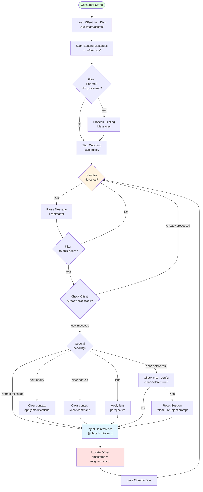

# Event Log Consumer Architecture

Detailed view of how event log consumers work to deliver messages to agents.

## Description

Event log consumers are the core delivery mechanism in TX. Each agent has one consumer that:

**Initialization Phase**:
1. **Load Offset** - Read last processed timestamp from `.ai/tx/state/offsets/`
2. **Scan Existing** - Process any messages written while consumer was offline
3. **Start Watching** - Begin watching `.ai/tx/msgs/` for new files

**Processing Loop**:
1. **Detect New File** - Chokidar file watcher triggers on new `.md` files
2. **Parse Message** - Extract frontmatter (to, from, type, status, msg-id)
3. **Filter** - Check if message is addressed to this agent
4. **Check Offset** - Verify message timestamp > last processed timestamp
5. **Special Handling** - Apply any special directives:
   - `self-modify: true` - Clear context and apply prompt modifications
   - `clear-context: true` - Run `/clear` command before injection
   - `lens: <lens-name>` - Apply cognitive lens perspective
   - `clear-before` + `task` - Reset session if mesh config has `clear-before: true`
6. **Inject File** - Inject file reference (`@filepath`) into tmux session
7. **Update Offset** - Record message timestamp as last processed
8. **Save Offset** - Persist offset to disk for restart safety

**Key Features**:
- **Restart Safe** - Offset tracking prevents duplicate message delivery
- **Chronological** - Messages processed in timestamp order
- **Idempotent** - Can restart consumer without side effects
- **Isolated** - Each agent's consumer runs independently
- **Efficient** - File watching prevents polling

**Consumer State**:
- Offset file: `.ai/tx/state/offsets/{mesh}-{agent}.json`
- Contains: `{ agentId, lastProcessedTimestamp, updatedAt }`
- Atomic writes ensure consistency
