# Human-in-the-Loop (HITL) Workflow

How agents request human input and wait for responses during task execution.

```mermaid
sequenceDiagram
    participant User as User (Human)
    participant Core as Core Agent
    participant EventLog as Event Log
    participant Agent as Research Agent
    participant Notifier as Notifier System

    Note over Agent: Processing research task

    Agent->>Agent: Encounters decision point<br/>Needs human input

    Agent->>EventLog: Write ask-human message<br/>to: core<br/>type: ask-human

    Note over EventLog: ask-human message<br/>blocks agent progress

    Core->>EventLog: Consumer detects<br/>ask-human message

    EventLog->>Notifier: Trigger notification
    Note over Notifier: Send notification via:<br/>- Docker (if available)<br/>- System notification<br/>- Audio alert

    Notifier-->>User: 🔔 "Research agent<br/>needs your input"

    Core->>Core: Inject ask-human<br/>into session

    Core->>User: Display agent's question

    Note over User: User reads question<br/>Considers options<br/>Makes decision

    User->>Core: Provide response

    Core->>EventLog: Write ask-response<br/>to: research-abc123/searcher<br/>type: ask-response

    Agent->>EventLog: Consumer detects<br/>ask-response

    EventLog->>Agent: Deliver response<br/>via @filepath

    Agent->>Agent: Continue processing<br/>with human input

    Agent->>EventLog: Write task-complete

    Note over Agent: Task complete with<br/>human-guided decisions
```



## Description

Human-in-the-Loop (HITL) enables agents to request human input during task execution, combining AI automation with human judgment.

**HITL Flow**:

1. **Decision Point** - Agent encounters situation requiring human input
   - Ambiguous requirements
   - Risk assessment needed
   - Quality judgment required
   - Strategic decision

2. **Ask-Human Message** - Agent writes message to core
   ```yaml
   to: core
   from: research-abc123/searcher
   type: ask-human
   status: start
   msg-id: abc123
   headline: "Which approach should I use?"
   ```

3. **Notification** - System alerts user
   - Desktop notification (if Docker available)
   - System tray notification
   - Audio alert (configurable)
   - Message appears in core session

4. **User Response** - Human provides input via core
   - User reads agent's question
   - Considers context and options
   - Makes decision
   - Types response to core

5. **Response Delivery** - Core sends answer to agent
   ```yaml
   to: research-abc123/searcher
   from: core
   type: ask-response
   status: complete
   msg-id: abc123
   ```

6. **Agent Continues** - Agent receives response and proceeds
   - Incorporates human decision
   - Continues task execution
   - May ask again if needed

**Use Cases**:

**Strategic Decisions**:
- "Should we optimize for speed or accuracy?"
- "Which of these three architectures should we use?"
- "Does this meet your requirements?"

**Ambiguity Resolution**:
- "I found two conflicting sources. Which is correct?"
- "The spec is unclear on this point. What's your intent?"
- "Multiple valid approaches exist. Your preference?"

**Quality Judgment**:
- "I've generated three designs. Which do you prefer?"
- "This code works but feels complex. Refactor or keep?"
- "I can continue or stop here. Your call?"

**Risk Assessment**:
- "This change could break X. Proceed anyway?"
- "I found a potential security issue. How critical is this?"
- "The deadline is tight. Cut scope or extend timeline?"

**HITL Patterns**:

### Pattern 1: Simple Ask
```
Agent → Human: Single question
Human → Agent: Single answer
Agent continues
```

### Pattern 2: Iterative Refinement
```
Agent → Human: "Here's draft 1. Feedback?"
Human → Agent: "Needs more detail on X"
Agent → Human: "Here's draft 2. Better?"
Human → Agent: "Perfect!"
Agent completes
```

### Pattern 3: Approval Gate
```
Agent → Human: "Ready to deploy. Approve?"
Human → Agent: "Approved" or "Wait, fix Y first"
Agent proceeds or revises
```

### Pattern 4: Progressive Disclosure
```
Agent → Human: "Found 10 results. See all or filter?"
Human → Agent: "Filter by criteria X"
Agent → Human: "Here are 3 results. Deep dive on which?"
Human → Agent: "Result 2"
Agent deep dives
```

**Benefits**:
- **Quality** - Human judgment on critical decisions
- **Flexibility** - Handle unexpected situations
- **Learning** - Agents learn from human responses
- **Trust** - User maintains control

**Implementation**:
- **Non-blocking** - Other meshes continue running
- **Persistent** - Messages saved in event log
- **Auditable** - Complete Q&A history preserved
- **Resumable** - Can restart without losing context

**Notification System**:
- Checks for Docker availability
- Uses `host.docker.internal` for Docker notifications
- Falls back to system notifications
- Configurable per mesh/agent
