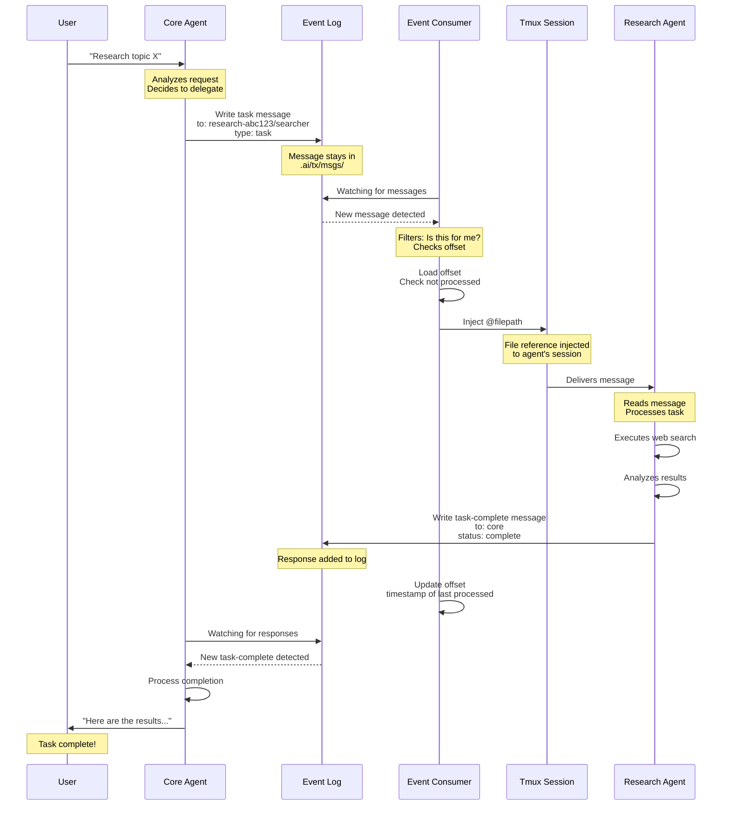

# Sample Session Flow

Step-by-step sequence diagram showing a typical workflow from user request to task completion.

## Description

This diagram shows the complete flow of a typical task in TX:

1. **User Request** - User asks core agent to research a topic
2. **Task Delegation** - Core creates a task message for research agent
3. **Message Writing** - Task written to event log (`.ai/tx/msgs/`)
4. **Consumer Detection** - Research agent's consumer detects new message
5. **Offset Check** - Consumer verifies message hasn't been processed yet
6. **Message Injection** - Consumer injects file reference into tmux session
7. **Agent Processing** - Agent reads message, executes task
8. **Response Writing** - Agent writes task-complete message to event log
9. **Offset Update** - Consumer updates its offset (last processed timestamp)
10. **Core Notification** - Core's consumer detects task-complete message
11. **User Response** - Core delivers results back to user

**Key Concepts**:
- **Stay-in-place**: Messages never move, only file references (`@filepath`) injected
- **Asynchronous**: Agent processing happens independently
- **Event-driven**: Event log is central communication hub
- **Stateless consumers**: Offset tracking enables restart without reprocessing
